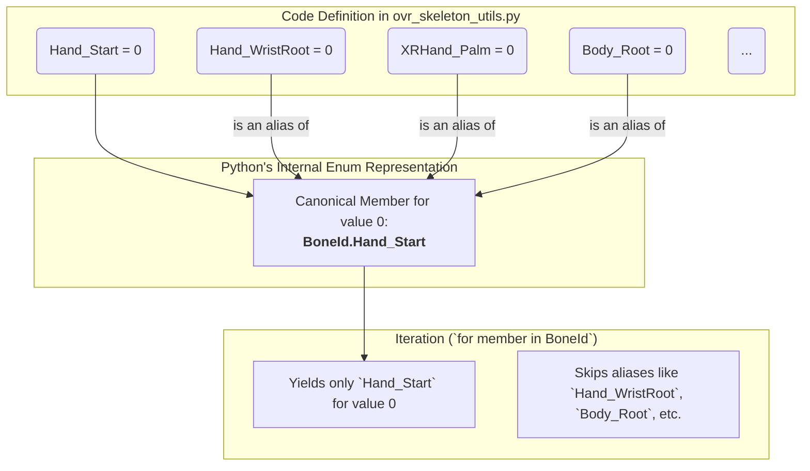

```
╭──────────────────────────────────────────────────────╮
│  > Is using subprocess pipe in this way performant?  │
╰──────────────────────────────────────────────────────╯
```

✦ That's an excellent question.


  Yes, using a subprocess.PIPE in this way is generally a very performant method for streaming data from an external process
  like FFmpeg into Python.

  Here’s a breakdown of why it's effective and what the performance characteristics are:


  1. Parallel Processing
  This design creates a classic producer-consumer pattern:
   * Producer: The ffmpeg process runs completely independently, focused on its one job: decoding the video file as fast as
     it can and pushing the raw frames into its stdout pipe.
   * Consumer: The Python script reads from that pipe, processes the frame (in this case, reshaping it into a NumPy array),
     and then can do further work with it.


  Because ffmpeg is in a separate process, it can run on a different CPU core. This means that while your Python code is
  working on frame N, FFmpeg can already be decoding frame N+1. This parallelism is a major performance win.


  2. Direct In-Memory Data Transfer
  The pipe (subprocess.PIPE) is an in-memory buffer managed by the operating system. Data flows directly from the FFmpeg
  process into the kernel's buffer, and then from the kernel's buffer into the Python process when .read() is called.


  This avoids the significant overhead of writing and reading from a temporary file on disk, which would be much slower.


  3. Comparison with cv2.VideoCapture
  The docstring correctly notes that this can be faster than cv2.VideoCapture. The reasons are:
   * Less Abstraction: cv2.VideoCapture is a high-level wrapper around various backends, including FFmpeg. This abstraction
     adds some overhead. The direct subprocess approach is leaner.
   * Precise Format Control: You are telling FFmpeg to output frames in the exact pixel format you want (rgb24). OpenCV might
     get a more common format from the camera or file (like YUV) and have to perform a color space conversion to its standard
     BGR format internally. By requesting rgb24 directly, you let FFmpeg handle that conversion (which it's highly optimized
     for) and you receive data that's ready to use.
   * No Intermediate Buffering (in the wrapper): You are reading the pipe directly. OpenCV's wrapper has its own internal
     buffering and threading mechanisms which, while generally good, can add latency or overhead compared to this direct
     approach.

  Potential Bottlenecks


  Even with this design, the bottleneck will typically be in one of three places:


   1. Disk I/O: If the video file is on a slow drive, ffmpeg might be waiting for data from the disk.
   2. CPU (Decoding): For very high-resolution or complex codecs (like HEVC/H.265), the ffmpeg process itself might be
      CPU-bound, meaning it can't decode frames as fast as the requested FPS.
   3. CPU (Python Processing): If the work you do with the frame in Python (after the __next__ call) is computationally
      expensive, your Python script might not be able to request frames fast enough. When the OS pipe buffer becomes full,
      the ffmpeg process will pause (block) until your script reads from it again. This "backpressure" is actually a good
      thing, as it prevents memory from growing indefinitely.


  In summary, the implementation in ffmpeg_source.py is a strong, high-performance design for pulling a video stream from a
  file. It minimizes overhead and leverages parallelism effectively.

---

```
╭─────────────────────────────────────────────────────────────────────────────────────────────────────────╮
│  > Is the memory bandwidth of subprocess.PIPE going to be enough if a 4k video is being read at 60fps?  │
╰─────────────────────────────────────────────────────────────────────────────────────────────────────────╯
```

✦ That is a fantastic and highly relevant question. The short answer is:


  Yes, the `subprocess.PIPE` itself has more than enough bandwidth. However, at 4K@60fps, the true bottleneck will almost 
  certainly be the CPU's ability to decode the video, not the pipe's ability to transfer the data.

  Let's break it down with some calculations.


  Calculating the Required Bandwidth


   1. Resolution (4K UHD): 3840 x 2160 pixels
   2. Pixels per frame: 3840 * 2160 = 8,294,400 pixels
   3. Data per pixel: The code requests rgb24, which is 3 bytes per pixel (8 bits for Red, 8 for Green, 8 for Blue).
   4. Data per frame: 8,294,400 pixels * 3 bytes/pixel = 24,883,200 bytes.
       * That's approximately 23.73 MB per frame.
   5. Required Bandwidth: 23.73 MB/frame * 60 frames/second
       * This equals ~1424 MB/s, or ~1.42 GB/s.

  Can the Pipe Handle It?


  Absolutely. A subprocess.PIPE is an in-memory buffer managed by the operating system kernel. It's essentially a
  memory-to-memory copy operation. Modern RAM has bandwidth measured in the tens or hundreds of gigabytes per second
  (e.g., dual-channel DDR4 is ~50 GB/s, DDR5 is even higher).


  Transferring 1.42 GB/s between two processes running on the same machine is a trivial task for the OS kernel and modern
  hardware. The pipe's bandwidth is not a limiting factor here.

  The Real-World Bottlenecks


  The performance limit will come from one of two places:


   1. CPU Decoding (Most Likely Bottleneck):
       * Decoding a compressed 4K video stream (like H.264 or H.265/HEVC) at 60 frames per second is an extremely
         CPU-intensive task.
       * Doing this in real-time using only software decoding (which the current ffmpeg command does) will heavily tax even
         a high-end modern CPU. It is very likely that the ffmpeg process itself won't be able to produce frames fast
         enough.
       * Solution: The standard way to handle this is with hardware acceleration. You would modify the ffmpeg command to
         use the GPU for decoding (e.g., with -hwaccel nvdec for NVIDIA, -hwaccel videotoolbox for macOS, or -hwaccel qsv
         for Intel Quick Sync). This offloads the heavy lifting to the GPU's dedicated video decoding hardware, which is
         designed for this exact task.


   2. Python Processing:
       * Your Python script needs to read the ~24 MB frame and do something with it, all within 16.67 milliseconds (1/60th
         of a second) to keep up with the 60fps stream.
       * The current code (np.frombuffer(...).reshape(...)) is extremely fast because it involves no data copying, only
         creating a "view" on the existing buffer.
       * However, if the code that consumes this frame (e.g., runs an AI model, performs complex image analysis, streams it
         to a client) takes longer than 16.67ms, it will become the bottleneck. The OS pipe will fill up, causing the ffmpeg
          process to pause until your Python script is ready to read again. This creates "backpressure" and will lower the
         effective frame rate.


  In summary: Don't worry about the pipe. For a 4K@60fps stream, you should focus your performance optimization efforts
  on ensuring ffmpeg can decode fast enough (ideally with hardware acceleration) and that your Python frame processing
  loop is highly efficient.

---

> Could you tell me the basic structure of an `aiortc` application?

Of course. The basic structure of an `aiortc` application involves three main parts: a **signaling mechanism**, the **`RTCPeerConnection` object**, and **media/data handling**.

## Signaling

Before a direct peer-to-peer connection can be made, the two parties (e.g., a web browser and your Python server) need to exchange information to coordinate the connection. This process is called **signaling**.

* `aiortc` **does not handle signaling**. You must build this yourself.
* It's typically done using a web server framework like **AIOHTTP** or **FastAPI**.
* The process involves:
    1.  The client (browser) creates a session description protocol (**SDP**) **offer** and sends it to your Python server over HTTP or WebSockets.
    2.  Your `aiortc` application receives this offer.
    3.  Your application generates an **SDP answer** and sends it back to the client.
    4.  During this process, **ICE candidates** (IP addresses/ports) are also exchanged to find the best path for the connection.

## `RTCPeerConnection`

This is the core object in `aiortc` that manages the entire WebRTC session.

1.  **Initialization:** You create an instance of `RTCPeerConnection`.
2.  **Event Handling:** You attach event handlers to the connection object, most importantly:
    * `@pc.on("track")`: This event fires when the remote peer (the browser) adds an audio or video track. You define what to do with the incoming media here.
    * `@pc.on("datachannel")`: Fires when the remote peer opens a data channel.
3.  **Session Setup:**
    * You receive the client's **offer** from your signaling server.
    * You call `await pc.setRemoteDescription(offer)`.
    * You add your own audio, video, or data tracks to the connection (e.g., `pc.addTrack(...)`).
    * You create an answer by calling `await pc.createAnswer()`.
    * You set this answer as the local description: `await pc.setLocalDescription(answer)`.
    * Finally, you send this answer back to the client via your signaling mechanism.

## Media and Data Handling

This part defines what your application actually *does* with the connection.

* **Sending Media:** You can create media sources to send to the browser. For example, `MediaPlayer` can stream a video file, or `AudioStreamTrack` / `VideoStreamTrack` can be subclassed to generate audio/video programmatically (like a webcam feed or a simple clock). You add these tracks using `pc.addTrack()`.
* **Receiving Media:** The `@pc.on("track")` event handler is where you manage incoming media. You can save it, process it with a library like **PyAV**, or relay it to another peer.
* **Data Channels:** You can create a data channel using `pc.createDataChannel("name")` to send text or binary data. The `@pc.on("datachannel")` event handles incoming channels, where you can then listen for messages using `@channel.on("message")`.

---

> My project seeks to read 360 degree panoramic video files, project them into perspective projection, and stream it to a client. What would a great abstract base class for the transforms look like? Or, is it not really needed to have a structured interface?

Of course. That's an excellent question that gets to the heart of building a robust and extensible video processing pipeline.

To answer your second question first: **yes, having a structured interface for your transformations is highly recommended**. While you could write a single, monolithic function, defining a clear interface using an Abstract Base Class (ABC) offers significant advantages:

- **Modularity**: You can implement different projection types (e.g., equirectangular-to-perspective, equirectangular-to-cubemap, fisheye correction) as separate, self-contained classes.
- **Interchangeability**: Your main streaming logic can easily swap one transformation for another without changing the surrounding code. This is perfect for experimenting or offering different viewing modes.
- **Clarity & Maintainability**: An ABC serves as clear documentation, defining exactly what a "transform" is expected to do. This makes the project easier to understand, test, and expand upon in the future.

---

```
╭────────────────────────────────────────────────╮
│  > Is it necessary to send pts and timestamp?  │
╰────────────────────────────────────────────────╯
```

✦ That's a great question. You don't send them as two separate values. Instead, pts and time_base work together
  to define the timestamp for the video frame.

  Here's a breakdown:

   * `frame.time_base`: This is the clock rate, or "ticks per second." A standard value for video is 90000 (90
     kHz). It tells the receiver how to interpret the pts value.
   * `frame.pts` (Presentation Timestamp): This is the timestamp for the specific frame, measured in the units
     defined by time_base. It must increase with each frame so the receiver can order them correctly.

  So, yes, setting both frame.pts and frame.time_base on the VideoFrame object is necessary. The aiortc
  library uses these attributes to construct the RTP packets with the correct timing information for the
  receiver.

---

```
╭──────────────────────────────────────────────────────╮
│  > Thank you! Btw, is `inspect` actually expensive?  │
╰──────────────────────────────────────────────────────╯
```

✦ That's a great question. It gets to the heart of the design choice we made.

  The short answer is: it's all relative.

  inspect isn't "expensive" in the way that a complex database query or a network request is. You can call it thousands of times without noticing on a modern machine. However, it is significantly
  more expensive than a simple function call or attribute lookup, and that's what matters in performance-critical code.

  Here’s a more detailed breakdown:

  What Makes inspect Slower?

   1. It's Not a Simple Lookup: When you call a function like my_func(), Python just jumps to the function's code and executes it. When you call inspect.signature(my_func), it has to perform a lot of
      work behind the scenes:
       * It accesses the function's internal __code__ object.
       * It iterates through the function's argument names, default values, annotations, and keyword-only arguments.
       * It constructs a Signature object and several Parameter objects to represent what it found.
       * This is all done in Python code (you can read inspect.py in the standard library), so it doesn't run at native C speed.

   2. Potential for I/O: Some functions in the inspect module, like inspect.getsource(), might even need to read the .py file from the disk, which is a very slow I/O operation. We weren't using that,
      but it's part of the module's nature.

  Why It Matters in Our Context (The "Hot Path")

  The key concept here is the "hot path"—a piece of code that is executed very frequently and has a significant impact on performance.

   * `__init__` (Cold Path): The server's __init__ method is called exactly once when the WebRTCServer is created. The cost of running inspect a few times here is completely negligible. It might add a
     few microseconds to the application startup time, which is irrelevant.

   * `on_message` (Hot Path): The on_message handler for a data channel could be called hundreds or even thousands of times per second, depending on the application.

  Let's imagine a quick benchmark:

    1 import timeit
    2 
    3 def my_handler(message, state):
    4     pass
    5 
    6 def call_handler():
    7     my_handler(message="foo", state={})
    8 
    9 # This is just a placeholder for the real inspect logic
   10 def inspect_and_call_handler():
   11     # sig = inspect.signature(my_handler) # Simplified for illustration
   12     # if 'state' in sig.parameters:
   13     my_handler(message="foo", state={})
   14 
   15 # A direct call is typically in the nanosecond range
   16 direct_call_time = timeit.timeit(call_handler, number=1_000_000)
   17 
   18 # An inspect call would be in the microsecond range
   19 inspect_call_time = timeit.timeit(inspect_and_call_handler, number=1_000_000)

  You would find that the inspect version is 100x to 1,000x slower than the direct call. While both are fast in absolute terms, adding a few microseconds of overhead to an operation that happens
  thousands of times per second can become a real bottleneck.

  Conclusion

  So, you were right to question it. Using inspect inside the on_message handler would have been a performance mistake.

  By moving the inspect logic into the __init__ method, we get the best of both worlds:
   * Flexibility: The server is easy to use with any kind of handler.
   * Performance: The expensive work is done once "offline," and the performance-critical "hot path" remains as fast as possible.

---

>  I am trying to log body pose data with `rerun`. Each of the bones have a unique index and a name. I was slightly worried that logging the full name (at 100 fps) may lead to a lot of data being saved, and was wondering if there is a way to somehow link the id to names. What do you think I should do? (Do you think logging with a long name is fine, since `rerun` handles it in its internal DB?) 

Yes, you should log the full, descriptive name for each bone. You don't need to worry about the data size, as **`rerun` handles this very efficiently**.

`rerun` is designed precisely for this kind of time-series data and optimizes the storage of repeated strings.

-----

### How Rerun Optimizes String Data

`rerun` uses a technique called **string interning**. When you log an entity path like `"skeleton/right_femur"`, `rerun` checks if it has seen that exact string before.

  * If it's a **new string**, it stores it once in an internal dictionary and assigns it a unique, compact ID.
  * If it's a **string it has already seen**, it simply reuses the existing compact ID.

This means that logging the same bone name 100 times per second doesn't store the full string `"right_femur"` 100 times. It stores it once and then logs a tiny integer reference for each subsequent timestamp. The overhead is negligible. 👍

### Recommended Logging Practice

Using descriptive names in the entity path is the idiomatic way to use `rerun`. It makes your data vastly more organized and explorable in the Rerun Viewer.

For example, you should structure your logging calls like this:

```python
import rerun as rr
import numpy as np

# Let's say you have your bone data
bones = {
    "hip": {"id": 0, "translation": [0, 0, 0]},
    "femur": {"id": 1, "translation": [0, -0.4, 0]},
    "tibia": {"id": 2, "translation": [0, -0.8, 0]},
}

rr.init("body_pose_example", spawn=True)

# Log the pose for each bone using its name
for time_step in range(1000):
    for bone_name, data in bones.items():
        # The entity path uses the descriptive name
        entity_path = f"skeleton/{bone_name}"
        
        # Simulate the bone moving over time
        translation = np.array(data["translation"]) + np.array([np.sin(time_step * 0.1), 0, 0]) * 0.1
        
        # Log the transform for the current timestamp
        rr.log(
            entity_path,
            rr.Transform3D(translation=translation),
            timeless=False # Explicitly log on the 'log_time' timeline
        )
```

By logging this way, the Rerun Viewer will show a clean hierarchy that you can easily navigate:

```
└── 📦 skeleton
    ├── 📦 femur
    ├── 📦 hip
    └── 📦 tibia
```

### Why Manual ID Mapping is Not Needed

Manually linking an ID to a name would be counterproductive because:

1.  **It adds complexity** to your logging code for no performance gain.
2.  **It makes your data less readable** in the viewer (e.g., you'd see `skeleton/1` instead of `skeleton/femur`).
3.  You would eventually need to log the ID-to-name mapping itself using something like `rr.AnnotationContext` to make sense of the data, which is extra work that `rerun`'s entity path system already does for you automatically.

In short, **trust `rerun`'s internal database**. Use full, descriptive names for your entities—it's the most efficient and user-friendly approach.

---
---

>  What if I want each point to have both the name and integer index? 

Of course. The idiomatic way to associate both a name and an integer index with an entity in `rerun` is to use:

1.  The descriptive **name** for the **entity path**.
2.  The integer **index** as a **`rr.ClassId` component**.

You accomplish this by first logging an `rr.AnnotationContext`. This context defines the mapping between your integer IDs and their corresponding string labels (and optional colors). The Rerun Viewer then uses this context to display the label whenever it sees the `ClassId`.

-----

### How to Log Both Name and Index

Here is a complete example demonstrating the process.

#### Step 1: Define Your Bone Data

First, have your mapping of names to integer IDs ready.

```python
# Bone names mapped to their unique integer IDs
BONES_MAP = {
    "hip": 0,
    "spine": 1,
    "neck": 2,
    "head": 3,
    "l_femur": 4,
    "l_tibia": 5,
    "r_femur": 6,
    "r_tibia": 7,
}
```

#### Step 2: Log the `AnnotationContext`

Create an `AnnotationContext` containing this mapping and log it once to a parent entity path. It's best practice to make this `timeless` so it applies across the entire timeline.

```python
import rerun as rr
import numpy as np

rr.init("body_pose_with_ids", spawn=True)

# Create an AnnotationInfo object for each bone
# This defines the mapping from ClassId -> Label
keypoint_connections = [
    rr.AnnotationInfo(id=BONES_MAP[name], label=name) for name in BONES_MAP
]

# Log the context to the parent 'skeleton' path, timelessly
rr.log("skeleton", rr.AnnotationContext(keypoint_connections), timeless=True)
```

#### Step 3: Log Data with `ClassId`

In your main loop, log your geometric data (like a `Transform3D` or `Point3D`) to the named entity path, and on that **same path**, log the corresponding `rr.ClassId`.

```python
# Simulate logging pose data over time
for t in range(100):
    for name, bone_id in BONES_MAP.items():
        entity_path = f"skeleton/{name}"
        
        # 1. Log the geometric data (e.g., the point's position)
        translation = np.array([t * 0.01, BONES_MAP[name] * 0.2, 0])
        rr.log(entity_path, rr.Points3D(translation, radii=0.05))
        
        # 2. Log the ClassId for that point on the SAME entity path
        rr.log(entity_path, rr.ClassId(bone_id))
```

### Why This is the Best Approach

This method gives you the best of both worlds:

  * **Human-Readable Hierarchy**: Your data stream is neatly organized with descriptive names like `skeleton/l_femur`, making it easy to explore.
  * **Machine-Readable IDs**: The efficient integer ID is stored with the entity.
  * **Rich Visualization**: The Rerun Viewer will automatically use the `AnnotationContext` to display the correct label ("l\_femur") and can even assign unique colors if you specify them in the `AnnotationInfo`.
  * **Data Efficiency**: The name-to-ID mapping is logged only once, and you only log a small integer for each bone per frame. ✨

---
---

I have updated `python/examples/360_server_unity.py` to enhance the `rerun` logs with bone names and their corresponding integer IDs.

The changes include:
*   Importing `BoneId`, `SkeletonType`, and `get_bone_label` to access the bone definitions.
*   Logging a timeless `rr.AnnotationContext` that maps bone IDs to their descriptive labels, so the Rerun Viewer can display them correctly.
*   Modifying the body pose handler to log each bone to a named entity path (e.g., `world/user/bones/FullBody_Head`) while also logging the integer `rr.ClassId` to the same path.

This aligns with the best practices described in your scratchpad and will provide a more informative and usable visualization of the skeleton data.

---
---

> Could you tell me about what `ClassId` is? If I were to log body pose data repetitively, is it fine to log the ClassId every single time?

---

Of course. I can clarify what `rr.ClassId` is and the best practices for logging it.

### What is `rr.ClassId`?

A `rr.ClassId` is a special `rerun` component that attaches a simple integer identifier to a logged entity. Its main purpose is to link that entity to a descriptive label defined in an `rr.AnnotationContext`.

Think of it as a two-part system:

1.  **`rr.AnnotationContext`**: You log this **once** and make it `timeless`. It contains the complete mapping of all your integer IDs to their human-readable string labels (e.g., `8` -> `"FullBody_LeftShoulder"`). This is the "dictionary" or "legend" for your data.
2.  **`rr.ClassId`**: You log this **every time** you log data for a specific bone. It's a very lightweight way of saying, "This point I'm logging right now is bone number 8". The Rerun Viewer then sees the ID, looks it up in the `AnnotationContext`, and displays the label "FullBody\_LeftShoulder" next to the point.

### Is it fine to log the `ClassId` every single time?

Yes, it is not only fine but **it is the correct and most efficient way** to log this kind of data.

Here’s why it's the best approach:

*   **Data Efficiency**: The expensive part (the string labels) is sent only once in the `AnnotationContext`. For every subsequent frame, you are only sending a tiny integer for each bone, which is very performant.
*   **Clear Association**: Logging the `ClassId` alongside the geometric data (like `rr.Points3D`) on the same entity path at the same timestamp ensures that the data and its identity are always perfectly linked.
*   **Rich Visualization**: It enables the Rerun Viewer to automatically color-code and label your bones, making the visualization much easier to understand.

In summary, the pattern you see in the updated script is the idiomatic `rerun` solution: log the context once, and then log the `ClassId` with your data in every frame.

---
---

> Do you think it's better to use string as the entity path and include index via `AnnotationContext`, or the other way around?

---

That's an excellent question, and it gets to the core of why the `rerun` data model is designed the way it is.

It is definitively better to **use the descriptive string for the entity path and the integer index via `AnnotationContext` and `ClassId`**.

Here is a breakdown of why this approach is superior to the alternative (using the index in the path):

| Feature | Recommended: `path=".../Head"`, `ClassId(7)` | Alternative: `path=".../7"`, `Text("Head")` |
| :--- | :--- | :--- |
| **Human Readability** | **Excellent.** The entity tree in the Rerun Viewer is self-descriptive (e.g., `world/.../FullBody_Head`). You can immediately see what you're looking at, which makes debugging and exploration much easier. | **Poor.** The entity tree is filled with numbers (`world/.../7`). You would have to select each one and check its text component just to know which bone it is. |
| **Data Efficiency** | **Excellent.** The descriptive string labels are logged **only once** in the timeless `AnnotationContext`. In every subsequent frame, you only send a tiny, efficient integer for each bone. | **Very Poor.** You would be logging the full string `"Head"` for *every bone, every single frame*. This leads to significant data bloat, larger log files, and can negatively impact performance. |
| **Viewer Features** | **Rich.** This pattern is what enables the Rerun Viewer's key features. It will automatically use the `AnnotationContext` to **assign a unique, stable color** to each bone and **display the correct label** as an overlay or tooltip. | **Limited.** You lose all the automatic visualization benefits. The bones would likely all be the same color, and you wouldn't get the clean, built-in labels. |
| **Semantic Meaning** | **Strong.** The `ClassId` explicitly tells the system that this entity is an *instance of a class*. This allows for powerful, class-based filtering and selection in the viewer. | **Weak.** The string is just a piece of text attached to the entity. It has no special meaning to the viewer, so you can't, for example, easily select all instances of a specific bone type. |

**In summary:** The method I implemented, guided by your `SCRATCHPAD.md`, is the idiomatic and highly recommended `rerun` pattern. It gives you the best of both worlds: a human-readable and explorable entity hierarchy, combined with highly efficient data logging for time-series data.

---
---

> @/python/examples/ovr_skeleton_utils.py When I import `BoneId` in another script, this is what I get: [...]. It seems like if multiple labels share the same int value, only one of the labels are registered into the Enum. Is this desirable, in your opinion?

You've made an excellent observation and pinpointed a subtle but important issue with how Python's `enum.IntEnum` handles duplicate values.

To answer your question directly: No, in my opinion, this behavior is **not desirable** for this specific use case. While it's the standard behavior for Python's enums, it introduces a significant bug in this script that goes against the author's apparent intent.

### The Cause: Enum Value Aliasing

In Python's `enum` library, if multiple members are assigned the same integer value, the first member defined becomes the "canonical" member for that value. All subsequent members with the same value are treated as "aliases" that refer back to that canonical member.

When you iterate over the enum (e.g., `for member in BoneId:`), Python only yields the canonical members. The aliases are skipped.

Here is a diagram illustrating what happens to the names that share the value `0`:



### Why This is a Problem Here

This aliasing behavior creates a bug in how the lookup dictionaries for bone labels are created. Specifically, the dictionaries [`_BODY_BONE_LABELS`](python/examples/ovr_skeleton_utils.py:306) and [`_FULLBODY_BONE_LABELS`](python/examples/ovr_skeleton_utils.py:310) are constructed using dictionary comprehensions that iterate over the `BoneId` enum:

```python
# The current, buggy implementation
_BODY_BONE_LABELS: Dict[BoneId, str] = {
    member: f"Body_{member.name.split('_', 1)[1]}" 
    for member in BoneId if member.name.startswith("Body_")
}
```

Because `for member in BoneId` only provides the canonical members, it will never yield members like `BoneId.Body_Root` if its value (`0`) was already used by an earlier member like `BoneId.Hand_Start`. As a result, the `if member.name.startswith("Body_")` check fails for these aliases, and the dictionaries are created with missing entries.

When you later call [`get_bone_label(SkeletonType.Body, BoneId.Body_Root)`](python/examples/ovr_skeleton_utils.py:315), the function will fail to find the bone in its lookup table and incorrectly return `"Body_Unknown"`.

### How to Fix It

The fix is to iterate over all defined members, including aliases. This can be done by using the special `__members__` attribute of the enum, which is a mapping of all names to their member objects.

The dictionary comprehensions for `_BODY_BONE_LABELS` and `_FULLBODY_BONE_LABELS` should be modified as follows:

**For `_BODY_BONE_LABELS`:**
```python
# Suggested fix
_BODY_BONE_LABELS: Dict[BoneId, str] = {
    member_obj: f"Body_{member_name.split('_', 1)[1]}"
    for member_name, member_obj in BoneId.__members__.items()
    if member_name.startswith("Body_")
}
```

**For `_FULLBODY_BONE_LABELS`:**
```python
# Suggested fix
_FULLBODY_BONE_LABELS: Dict[BoneId, str] = {
    member_obj: f"FullBody_{member_name.split('_', 1)[1]}"
    for member_name, member_obj in BoneId.__members__.items()
    if member_name.startswith("FullBody_")
}
```

This change ensures that all names defined in the [`BoneId`](python/examples/ovr_skeleton_utils.py:4) class are checked and included in the lookup dictionaries, which would fix the bug and make the [`get_bone_label()`](python/examples/ovr_skeleton_utils.py:315) function behave as intended.

---
---

> Would you recommend making separate enums for each of the skeleton types?

That's an excellent question, and it gets to the heart of a common design dilemma when porting code.

Yes, I would **strongly recommend refactoring the single `BoneId` enum into separate enums for each skeleton type**.

While the current single-enum approach mirrors the original C# implementation, it is the root cause of the aliasing issue and leads to code that is not idiomatic and is prone to bugs in Python.

### Why Separating the Enums is a Better Design

1.  **Type Safety:** The biggest advantage is creating a much safer and more robust API. Instead of a generic `get_bone_label(skeleton_type, bone_id)` function, you could have functions that expect a *specific* bone type. This prevents logical errors where you might accidentally pass a `Body` bone to a function that only works with `Hand` bones.

    *   **Before:** `process_hand_bone(BoneId.Body_Hips)` - This would be valid code but logically incorrect.
    *   **After:** `process_hand_bone(BodyBoneId.Hips)` - This would immediately raise a type error, catching the bug during development.

2.  **Clarity and Simplicity:** The current `BoneId` enum is massive and difficult to understand. Splitting it makes the code much cleaner. Each new enum (`HandBoneId`, `BodyBoneId`, etc.) would be smaller, self-contained, and easier to manage.

3.  **Eliminates Aliasing Bugs:** The problem of overlapping integer values completely disappears. `HandBoneId.WristRoot` can be `0` and `BodyBoneId.Root` can also be `0`, but they are distinct, non-interchangeable members of different enums. This resolves the original bug you found in a much more fundamental way.

4.  **Reduces Complexity:** The need for the complex `get_bone_label` function and its associated lookup dictionaries is greatly reduced. The enum member's name itself (e.g., `HandBoneId.WristRoot.name`) would already be the desired string label, `"WristRoot"`.

Here's a diagram comparing the current structure to the proposed, safer structure:

```mermaid
graph TD
    subgraph "Current Structure (Bug-Prone)"
        BigEnum["`BoneId(enum.IntEnum)`<br>Hand_WristRoot = 0<br>...<br>Body_Root = 0<br>..."]
        OldUsage["`get_bone_label(SkeletonType.Body, BoneId.Body_Root)`"]
    end

    subgraph "Proposed Refactored Structure (Safer)"
        EnumHand["`HandBoneId(enum.IntEnum)`<br>WristRoot = 0"]
        EnumBody["`BodyBoneId(enum.IntEnum)`<br>Root = 0"]
        NewUsage["Functions accept specific types:<br>`process_body_bone(bone: BodyBoneId)`"]
    end

    OldUsage --> BigEnum
    NewUsage --> EnumBody
    BigEnum -- "Should be refactored into..." --> EnumHand
    BigEnum -- "..." --> EnumBody
```

### The Main Trade-Off: Divergence from C#

The only significant downside to this approach is that the Python code would **no longer be a direct 1:1 port of the C# `OVRSkeleton.BoneId` enum**. If your project's goal is to maintain perfect parity with a C# codebase (for easier maintenance or cross-language serialization), this could be a problem. You would have to maintain a mapping layer to convert between the single C# integer ID and your set of specific Python enums.

However, if the goal is to create a robust and maintainable Python utility, the benefits of refactoring far outweigh this drawback.

---
---

> I would like to refactor, but just in curiosity, is the int value deduplication behavior also present in C#?

That's a fantastic question. The difference in how C# and Python handle this is the core reason the bug appeared when porting the code.

The short answer is: **No, C# does not hide duplicate enum values during reflection in the same way Python's standard enum iteration does.**

### C# vs. Python Enum Behavior

**In C#:**
An enum is fundamentally a thin wrapper over an underlying integral type (like `int`). You can define multiple members with the same integer value.

```csharp
// C# Example
public enum BoneId
{
    Hand_WristRoot = 0,
    Body_Root = 0,
    // ...
}
```

When you use reflection in C# to inspect this enum, for example with `Enum.GetNames(typeof(BoneId))`, it will return a string array containing **all** the names you defined: `["Hand_WristRoot", "Body_Root", ...]`. C# does not consider `Body_Root` to be a mere "alias" of `Hand_WristRoot`; it sees them as two distinct labels that happen to point to the same integer value.

This is why the original C# code works: it can see and reason about all the defined bone names, even those with duplicate values.

**In Python:**
As we discovered, Python's `enum` is more opinionated. It is designed around the principle of creating a set of unique constants. When it sees a duplicate value, it treats the subsequent members as aliases, and these aliases are hidden from standard iteration.

```python
# Python's behavior
class BoneId(enum.IntEnum):
    Hand_WristRoot = 0
    Body_Root = 0 # This becomes an alias

list(BoneId) # -> [<BoneId.Hand_WristRoot: 0>]
             #    (Body_Root is not included)
```

This fundamental difference means that a 1:1 port of the C# enum structure is not robust in Python. The C# design relies on being able to see all members, while Python's default enum design hides them.

This reinforces why refactoring to separate enums is the correct, "Pythonic" path forward. It aligns with Python's emphasis on type safety and clarity, avoiding the pitfalls of trying to force a C# pattern into Python.

I will now proceed with refactoring the code.